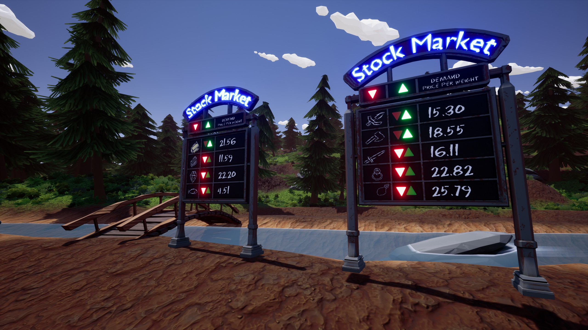

# Mods for Hydroneer

- [Get Hydroneer](https://store.steampowered.com/app/1106840/Hydroneer/)
- [Hydroneer Wiki](https://bridgepour.com/)
- [Hydroneer Discord](https://discord.gg/hydroneer)

This folder with contain all the .paks of mods where I worked on or collaborated with.

## Table of contents

- [Mods for Hydroneer](#mods-for-hydroneer)
  - [Table of contents](#table-of-contents)
  - [❗❗❗Required For **ALL MODS**❗❗❗](#required-for-all-mods)
  - [Current mods](#current-mods)
    - [500-InsideTraderBoard_P.pak](#500-insidetraderboard_ppak)
      - [Screenshot](#screenshot)
      - [Credits](#credits)

## ❗❗❗Required For **ALL MODS**❗❗❗

- [HydroUMH](https://github.com/RHlNO/HydroneerModding/raw/main/Release%20Mods/501-HydroUMH_P.pak)

## Current mods

### 500-InsideTraderBoard_P.pak

Adds a placeable board with all the stock markets.

Only way to get the board is by using the spawn menu from Rhino!
- [SpawnMenu](https://github.com/RHlNO/HydroneerModding/raw/main/Release%20Mods/500-SpawnMenu_P.pak)

#### Screenshot

#### Credits

- ResaloliPT
- F4T4L
- Hydroneer Community
